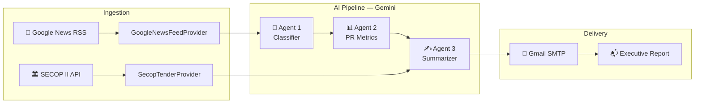

# 📰 CableNews – AI-Powered Industry Newsletter Agent


Automated news intelligence agent for the cable & electrical solutions industry. Fetches daily news from Google News RSS, classifies and scores with a multi-agent Gemini AI pipeline, calculates PR metrics (Share of Voice, sentiment analysis, competitor tracking), and delivers executive reports via email for Colombia, Peru, Chile, and Ecuador.

## Architecture



```
CableNews.Domain          → Entities, enums, base classes
CableNews.Application     → CQRS commands/handlers via MediatR, FluentValidation
CableNews.Infrastructure  → Google News RSS, Gemini API, Gmail SMTP, SECOP II
CableNews.Worker          → .NET Worker entry point + configuration
```

## Quick Start (Local)

```bash
dotnet restore CableNews.Worker/CableNews.Worker.csproj
dotnet build CableNews.Worker/CableNews.Worker.csproj
dotnet run --project CableNews.Worker/CableNews.Worker.csproj
```

> Secrets go in `appsettings.Development.json` (git-ignored).

## GitHub Actions Setup

### 1. Create the repository and push

```bash
git init
git add .
git commit -m "initial commit"
git remote add origin https://github.com/YOUR_USER/CableNews.git
git push -u origin main
```

### 2. Add secrets in GitHub

Go to **Settings → Secrets and variables → Actions → New repository secret** and add:

| Secret Name | Value |
|---|---|
| `GEMINI_API_KEY` | Your Gemini API key |
| `SMTP_PASSWORD` | Your Gmail app password |

### 3. Done!

The workflow runs automatically every day at **6:00 AM Colombia time** (11:00 UTC). You can also trigger it manually from **Actions → CableNews Daily Newsletter → Run workflow**.

## Running Tests

```bash
dotnet test CableNews.Application.UnitTests/CableNews.Application.UnitTests.csproj
```

## Configuration

All country-specific keywords are configured in `appsettings.json` under `NewsAgent.Countries`. Each country has:
- **DemandDrivers** – Energy, infrastructure, construction keywords
- **Institutions** – Government and regulatory bodies
- **Operators** – Major energy/utility companies
- **MacroSignals** – Economic indicators
- **SalesIntelligence** – Competitor tracking, tenders, project leads

## License

This project is licensed under the [MIT License](LICENSE).
